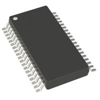
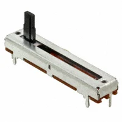

**Motor and Gearbox**

1. Uxcell JCF63R DC 24V 80W 160RPM High Torque Reversible Electric Gear Motor 160RPM

    

    * $59.49/each
    * [link to product](https://www.zoro.com/dayton-dc-gearmotor-16-in-lb-max-torque-25-rpm-nameplate-rpm-12v-dc-voltage-1lnh1/i/G2132471/?utm_source=google&utm_medium=surfaces&utm_campaign=shopping+feed&utm_content=free+google+shopping+clicks&campaignid=21424294680&productid=G2132471&v=&gad_source=1&gad_campaignid=21434744107&gbraid=0AAAAADw3hZdbZxKf682W9i5EiBvCWTD5Q&gclid=Cj0KCQjw0Y3HBhCxARIsAN7931V3Oedt1IsaJu4dS8x7Ug0Y-ESSQio3ILhy1EDES0ZBGx2hLF42gRkaApdJEALw_wcB&gclsrc=aw.ds#specifications)

    | Pros                                      | Cons                                                             |
    | ----------------------------------------- | ---------------------------------------------------------------- |
    | Powerful                               | Expensive |
    | Fully enclosed| Non-ventilated                                      |
    | Any angle orientation         | No thermal protection          |

1. Dc Gearmotor, 16 in-lb Max. Torque, 25 RPM Nameplate RPM, 12V DC Voltage

    

    * $67.90/each
    * [Link to product](https://www.harfington.com/products/p-1112952?currency=USD&variant=42120237646073&utm_source=google&utm_medium=cpc&utm_campaign=Google%20Shopping&stkn=f8e35277684b&utm_source=Google&utm_medium=cpc&utm_campaign=250707-us-pmax-all&utm_term=250707-us-pmax-all&utm_content=ywh&gad_source=1&gad_campaignid=22760023322&gbraid=0AAAAAoTFl2SIR0qGH3ollO3Tnn8GGOIi9&gclid=Cj0KCQjw0Y3HBhCxARIsAN7931WiyM3vYyTqHpTQ7v-rMtBlV2_nbhhwFQLgqAhpzkQAVQ7amr5mbH0aAnWiEALw_wcB)

    | Pros                                                              | Cons                |
    | ----------------------------------------------------------------- | ------------------- |
    | Used in heavy duty applications like moving cutrains.             | More expensive      |
    | High torque                                 | High heat when used constantly |
    | High speed that can make the door move quickly   | High voltage requirement    |

1. High Torque 12V DC Worm Gear Motor, 15 RPM

    

    * $25.39/each
    * [Link to product](https://www.robotshop.com/products/e-s-motor-high-torque-12v-dc-worm-gear-motor-15-rpm?qd=3081407f1db71f0fec5903ffe304727d)

    | Pros                                                              | Cons                |
    | ----------------------------------------------------------------- | ------------------- |
    | Low voltage requirement                                             | Smaller sized      |
    | Inexpensive                                | Low speed |
    | Self locking feature | transmission cannot be back-driven     |

**Choice:** Option 3: High Torque 12V DC Worm Gear Motor, 15 RPM

**Rationale:** We need a lower powered motor for our presentation. We also need something within budget and will still work even if the door is slow to open. This motor though small, may be able to use the dimenstions to make the product more userfriendly and compact. 

**H-Bridge**

1. L9110H H-Bridge Motor Driver for DC Motors - 8 DIP - 2.5V-12V 800mA

    

    * $1.50/each
    * [link to product](https://www.adafruit.com/product/4489)

    | Pros                                      | Cons                                                             |
    | ----------------------------------------- | ---------------------------------------------------------------- |
    | Can handle 12V                               | 8 pronged only so only one motor |
    | Inexpensive| 800 mA current limit                                   |
    | Comes with kickback diodes        | No split logic/power pins        |

1. Dual H-Bridge Motor Driver for DC or Steppers - 600mA - L293D

    

    * $8.95/each
    * [Link to product](https://www.adafruit.com/product/807)

    | Pros                                                              | Cons                |
    | ----------------------------------------------------------------- | ------------------- |
    | Up to 36 V           | More expensive      |
    | 16 pins                               | 600mA current Limit |
    | The motor voltage is separate from the logic voltage.   | Does not work under 4.5 V    |

1. MAX22208AUU+

    

    * $6.27/each
    * [Link to product](https://www.digikey.com/en/products/detail/analog-devices-inc-maxim-integrated/MAX22208AUU/25323715)

    | Pros                                                              | Cons                |
    | ----------------------------------------------------------------- | ------------------- |
    | High voltage range                                       | Too many pins      |
    | Reasonable cost                                | Big and bulky |
    | High operating temperature | Will be hard to put on a PCB    |

**Choice:** Option 1: L9110H H-Bridge Motor Driver for DC Motors - 8 DIP - 2.5V-12V 800mA

**Rationale:** Though being able to access more voltage would be nice, having more current access is what brought this above option 2. Option 3 is good, but we do not need that many pins and it would complicate the PCB baord and overcrowd the board. 

**Potentiometer**

1. Panel Mount 100K potentiometer (Breadboard Friendly) - 100KB

     - 100KB.jpg>)

    * $0.95/each
    * [link to product](https://www.adafruit.com/product/1831)

    | Pros                                      | Cons                                                             |
    | ----------------------------------------- | ---------------------------------------------------------------- |
    | Bigger Resistance                               | Havent used before |
    | Grippy Shaft| Thin prongs                                     |
    | Can cause bigger speed changes        | Only 300 degrees of rotation        |

1. Panel Mount 10K Log Potentiometer (Breadboard Friendly) - 10K Log

     - 10K Log.jpg>)

    * $0.95/each
    * [Link to product](https://www.adafruit.com/product/3391)

    | Pros                                                              | Cons                |
    | ----------------------------------------------------------------- | ------------------- |
    | Grippy Shaft             | Less resistance     |
    | High torque                                 | Thin Prongs |
    | Inexpensive   | Small handle    |

1. PTA3043-2010CIB104

    

    * $1.65/each
    * [Link to product](https://www.digikey.com/en/products/detail/bourns-inc/PTA3043-2010CIB104/3781186?gclsrc=aw.ds&gad_source=1&gad_campaignid=20243136172&gbraid=0AAAAADrbLliFVtbptKHwxHXZOLTZ9Dngt&gclid=CjwKCAjw0sfHBhB6EiwAQtv5qdDayR3wUdt1PhP_Zrn28sFLcQJGq9LoqSQneqg9s4Sqr2sY-hUGlRoC1iQQAvD_BwE)

    | Pros                                                              | Cons                |
    | ----------------------------------------------------------------- | ------------------- |
    | High resistance                                             | Big Size      |
    | Inexpensive                                | More space taken up on the PCB |
    | Slide instead of rotate | Not used to this type of potentiometer    |

**Choice:** Option 3: PTA3043-2010CIB104

**Rationale:** The slide potentiometer is a lot more user friendly than useal breadboard potentiometers. THis will also help where we can label different resistances to different speeds. Using only a small potentiometer was an option, but the changes in the motor speed would then need to be amplified in an op amp or similar to get results we could get with a higher resistance potentiometer. This also gives a wider range of speeds than a 10k potentiometer. 

**Unregulated Power Supply**

1. Wall Adapter Power Supply - 12VDC, 600mA (Barrel Jack)

    .webp>)

    * $9.25/each
    * [link to product](https://www.sparkfun.com/wall-adapter-power-supply-12vdc-600ma-barrel-jack.html)

    | Pros                                      | Cons                                                             |
    | ----------------------------------------- | ---------------------------------------------------------------- |
    | High voltage                               | Expensive |
    | Enough current| Only needed for the motor                                    |
    | Uses a barrel jack        | Not a well known supplier        |

1. Switching Split Power Supply ± 12V 500mA Split Supply

    

    * $14.95/each
    * [Link to product](https://www.adafruit.com/product/2591)

    | Pros                                                              | Cons                |
    | ----------------------------------------------------------------- | ------------------- |
    | Multiple jacks          | If used with other things would need a seperate voltage regulator |
    | Not too much current                                 | Might not need the white power supply line|
    | Up to 12 V| Short cord length   |

1. 12V 5A switching power supply

    

    * $24.95/each
    * [Link to product](https://www.adafruit.com/product/352)

    | Pros                                                              | Cons                |
    | ----------------------------------------------------------------- | ------------------- |
    | Up to 12 V                             | High current    |
    |  You can use any plug adapter                            | Expensive |
    | There's a green indicator light to let you know it's working | Bulky in the middle of wires  |

**Choice:** Option 3: 12V 5A switching power supply

**Rationale:** Though the supplier is not as well known and the data sheet is harder to understand, this had enough current without going overboard since this will power the whole system and not just this subsystem.

