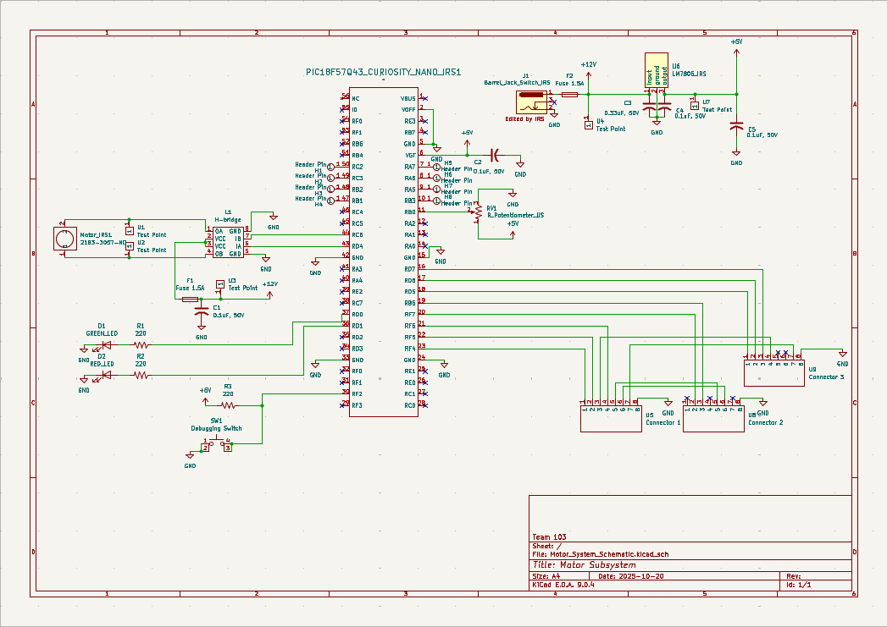

## Overview

This schematic is design to obtain 1/0 from the sensors to determine if it will go forward, reverse, or stop. This also shows where the power of 5V and 12V goes in this subsystem. 

{style width:"350" height:"300;"}
**Figure 1:** Shows the the motor schematic.

## Resouces

The schematic as a PDF download is available [*here*](isrysm52.github.io/docs/04-Schematic/Motor_System_Schematic.pdf), and the Zip folder of the project [*here*](isrysm52.github.io/docs/04-Schematic/Gerber_Motor_System_IRS.zip).