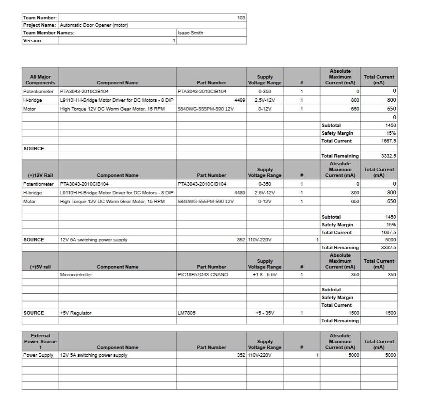

## Overview
This power budget was for the motor. It was needed because the motor was the only component required to use 12V. This meant that the power sources either needed to be separate or that the voltage regulators would draw power from this supply. Since the other subsystems will be drawing power from this supply, a power budget needed to be created to ensure that all components meet requirements and current withing a 12V 5A power supply. 

>

## Conclusions

From the prepare Power Budget, I am within a reasonable amount will well over extra that other subsystems can use. [Here](https://egr304-2025-f-103.github.io/Team%20Power%20Budget/) is the power budget of the whole team which shows that even with a significant 25% increase of our power budget, we still have extra current to use. 

We are using 12V because of the motor. The motor needs that power to push and pull a door open. That being said, the amps need to be small. The H-bridge could only take so much amps going through it so we took a amps size of 3A. THis all works while everyone has a voltage regulator even though they wiull be getting power from the motor system through the power source. Because they all share the power source we needed to make sure we had just enough amps and voltage to get through each subsystem with some buffer. 
## Resouces

The power budget as a PDF download is available [*here*](isrysm52.github.io/docs/05-Power-Budget/Power Budget - Sheet1.pdf), and a Microsoft Excel Sheet [*here*](isrysm52.github.io/docs/05-Power-Budget/Power Budget.xlsx).